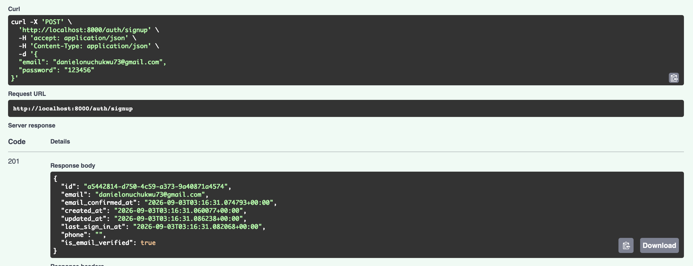
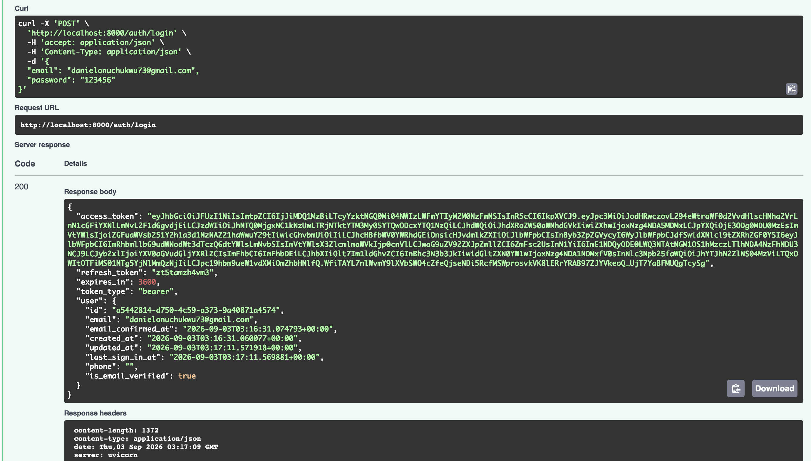
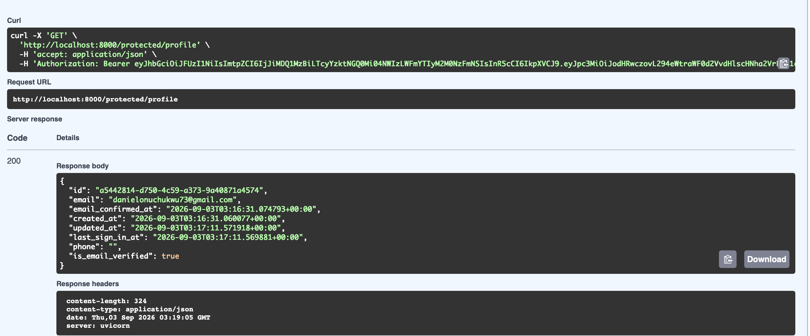
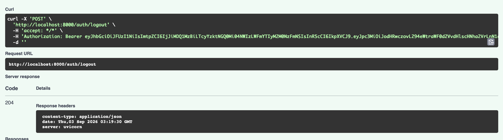

# FastAPI Supabase Auth

A simple authentication system built with FastAPI and Supabase. This project provides user registration, login, token verification, and protected routes using Supabase as the authentication backend.

## Setup

### Prerequisites

- Python 3.12 or higher
- Poetry for dependency management
- A Supabase project

### Installation

1. Clone the repository
2. Install dependencies using Poetry:

```bash
poetry install
```

### Environment Variables

Create a `.env` file in the project root with your Supabase credentials:

```env
SUPABASE_URL=your_supabase_project_url
SUPABASE_KEY=your_supabase_anon_key
```

You can find these values in your Supabase Dashboard under Project Settings > API.

### Supabase Configuration

To avoid email verification errors during login, you need to disable email confirmation in your Supabase project:

1. Open your Supabase Dashboard
2. Go to Authentication (the user icon in the sidebar) > Providers > Email
3. Turn off the toggle for "Confirm email"
4. Click Save

This allows users to log in immediately after signup without requiring email verification.

## Running the Project

Start the development server:

```bash
uvicorn src.main:app --reload --port 8000
```

The API will be available at `http://localhost:8000`

## API Documentation

Once the server is running, access the interactive API documentation at:

- Swagger UI: `http://localhost:8000/docs`
- ReDoc: `http://localhost:8000/redoc`

## Endpoint Reference

| Method | Endpoint | Description | Authentication |
| -------- | ---------- | ------------- | ---------------- |
| GET | `/` | Root endpoint | None |
| GET | `/health` | Health check | None |
| GET | `/public/info` | Public information | None |
| POST | `/auth/signup` | User registration | None |
| POST | `/auth/login` | User login | None |
| GET | `/protected/profile` | User profile | Bearer token |
| POST | `/auth/logout` | User logout | Bearer token |

## API Endpoints

### Public Endpoints

#### Root Endpoint

```http
GET /
```

Returns a welcome message.

#### Health Check

```http
GET /health
```

Returns the server health status.

#### Public Information

```http
GET /public/info
```

Returns public information accessible without authentication.

### Authentication Endpoints

#### Sign Up

```http
POST /auth/signup
Content-Type: application/json

{
  "email": "user@example.com",
  "password": "securepassword"
}
```

Response (201 Created):

```json
{
  "id": "user-id",
  "email": "user@example.com",
  "email_confirmed_at": "2026-09-03T12:00:00Z",
  "created_at": "2026-09-03T12:00:00Z",
  "updated_at": "2026-09-03T12:00:00Z",
  "last_sign_in_at": null,
  "phone": null,
  "is_email_verified": true
}
```

[[](screenshots/signup.png)]

#### Log In

```http
POST /auth/login
Content-Type: application/json

{
  "email": "user@example.com",
  "password": "securepassword"
}
```

Response (200 OK):

```json
{
  "access_token": "eyJhbGciOiJIUzI1NiIsInR5cCI6IkpXVCJ9...",
  "refresh_token": "refresh-token",
  "expires_in": 3600,
  "token_type": "bearer",
  "user": {
    "id": "user-id",
    "email": "user@example.com",
    "email_confirmed_at": "2026-09-03T12:00:00Z",
    "created_at": "2026-09-03T12:00:00Z",
    "updated_at": "2026-09-03T12:00:00Z",
    "last_sign_in_at": "2026-09-03T12:00:00Z",
    "phone": null,
    "is_email_verified": true
  }
}
```

[[](screenshots/login.png)]

### Protected Endpoints

#### User Profile

```http
GET /protected/profile
Authorization: Bearer your_access_token
```

Response (200 OK):

```json
{
  "id": "user-id",
  "email": "user@example.com",
  "email_confirmed_at": "2026-09-03T12:00:00Z",
  "created_at": "2026-09-03T12:00:00Z",
  "updated_at": "2026-09-03T12:00:00Z",
  "last_sign_in_at": "2026-09-03T12:00:00Z",
  "phone": null,
  "is_email_verified": true
}
```

[[](screenshots/protected-endpoint.png)]

#### Logout

```http
POST /auth/logout
Authorization: Bearer your_access_token
```

Response (204 No Content)

[[](screenshots/logout.png)]

## Swagger UI

The interactive API documentation provides a way to test all endpoints directly from your browser.

## Project Structure

```
fastapi-supabase-auth/
├── src/
│   ├── main.py      
│   └── models.py 
├── .env                 
├── pyproject.toml       
└── README.md            
```

## Error Handling

The API returns appropriate HTTP status codes and error messages:

- 400 Bad Request: Invalid input or missing required fields
- 401 Unauthorized: Invalid or expired token, incorrect credentials
- 409 Conflict: Logout operation failed
- 500 Internal Server Error: Server-side errors
